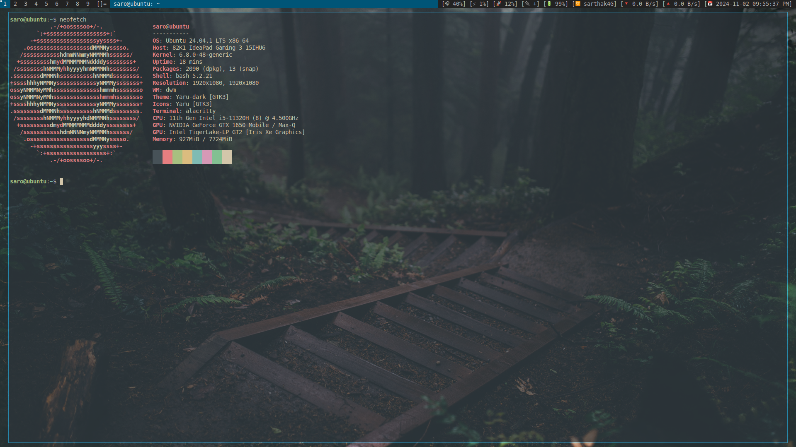

# Alacritty Configuration - Everforest Dark

This is a custom Alacritty configuration file that implements the Everforest Dark color scheme, providing a soothing and aesthetically pleasing terminal experience.

## Features

- **Everforest Dark Colors**: A carefully crafted color palette designed to reduce eye strain and enhance readability.
- **Custom Font Size**: Set to 10.5 for optimal text clarity.
- **Dynamic Padding**: The window includes dynamic padding for a polished look.
- **Opacity Settings**: Semi-transparent window to blend seamlessly with your desktop environment.

## Configuration Overview

### Colors

- **Background**: `#2d353b` (Dark Gray)
- **Foreground**: `#d3c6aa` (Light Beige)

#### Normal Colors
- Black: `#475258`
- Red: `#e67e80`
- Green: `#a7c080`
- Yellow: `#dbbc7f`
- Blue: `#7fbbb3`
- Magenta: `#d699b6`
- Cyan: `#83c092`
- White: `#d3c6aa`

#### Bright Colors
- Bright Black: `#475258`
- Bright Red: `#e67e80`
- Bright Green: `#a7c080`
- Bright Yellow: `#dbbc7f`
- Bright Blue: `#7fbbb3`
- Bright Magenta: `#d699b6`
- Bright Cyan: `#83c092`
- Bright White: `#d3c6aa`

### Font Settings

- **Font Size**: `10.5`

### Window Settings

- **Padding**: `3` pixels (x and y)
- **Dynamic Padding**: Enabled
- **Opacity**: `0.65` (Semi-transparent)

## Usage

1. **Clone this repository** or copy the configuration file to your local machine.
2. **Place the config file** in your Alacritty configuration directory (usually located at `~/.config/alacritty/alacritty.toml`).
3. **Restart Alacritty** to apply the changes.

## License

This configuration is free to use and modify. Enjoy a beautiful terminal experience!

## Screenshots

